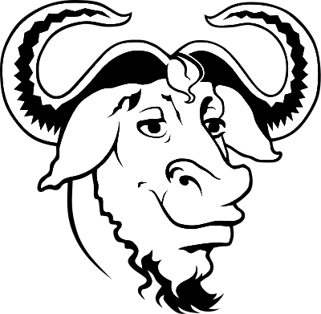

<div style="width: 100%; text-align: center;">



</div>

<h2>Alunos:</h2>
<b>
André Felipe Baretta<br>  
Guilherme Inoe Araujo<br>
Henry Meneguini Farias<br>
João Pedro Inoe Araujo
</b>

---
# Implementação do sistema de arquivos EXT2

## Descrição:
Este projeto é uma implementação do sistema de arquivos EXT2 escrito em linguagem C, desenvolvido por alunos do Bacharelado de Ciências da Computação da **UTFPR** (Universidade Tecnológica Federal do Paraná - Câmpus Campo Mourão) para a discliplina de Sistemas Operacionais com **fins exclusivamente educacionais**.

## Estruturas implementadas:
- Superbloco
- Descritor de bloco
- Inode
- i_osd2

## Estrutura do projeto:
```
.                       #Dir. raíz
├── Img                 #Dir. com as Imagens do README.md
├── include             #Dir. de cabeçalhos do EXT2
│   ├── EXT2.h          #Estruturas
│   └── EXT2_Utils.h    #Assinaturas das funções
├── main.c              #Função Principal
├── Makefile            #Script para compilar o projeto
├── myext2image.img     #Imagem para testes
├── README.md           #Apresentação e instruções de uso
├── Shell               #Dir. do Terminal
│   ├── Shell.c         #Funções do terminal
│   └── Shell.h         #Cabeçalhos do terminal
└── src                 #Dir. de funções do EXT2
    └── EXT2_Utils.c    #implementação das funções
```
## Como compilar e executar:
**Requisitos: Sistema Operacional GNU/Linux, gcc, make**

- Para compilar o programa,certifique-se de estar no diretório raíz do projeto e execute o comando `make` no terminal.  
- Um binário executável será gerado após compilar o programa junto com arquivos de objeto (.o).
- Para usar  o programa execute:

```
$ ./ext2shell <imagem.img>
```
- Os comandos a seguir podem ser executados no terminal:
  - **`help`**: exibe comandos e instruções de uso.
  - `info`: exibe informações do disco e do sistema de arquivos.
  - `cat <file>`: exibe o conteúdo de um arquivo no formato texto.
  - `attr <file | dir>`: exibe os atributos de um arquivo (file) ou diretório (dir).
  - `cd <path>`: altera o diretório corrente para o definido como path.
  - `ls`: lista os arquivos e diretórios do diretório corrente.
  - `pwd`: exibe o diretório corrente (caminho absoluto).
  - `touch <file>`: cria o arquivo file com conteúdo vazio.
  - `mkdir <dir>`: cria o diretório dir vazio.
  - `rm <file>`: remove o arquivo file do sistema.
  - `rmdir <dir>`: remove o diretório dir, se estiver vazio.
  - `rename <file> <newfilename> `: renomeia arquivo file para newfilename.
  - `cp <EXT2_file_path> <host_file_path>`: copia o conteúdo de um arquivo da imagem EXT2 para um arquivo no disco rígido da máquina real.

- Os arquivos gerados pelo programa podem ser apagados de forma prática executando o comando `make clean`.
